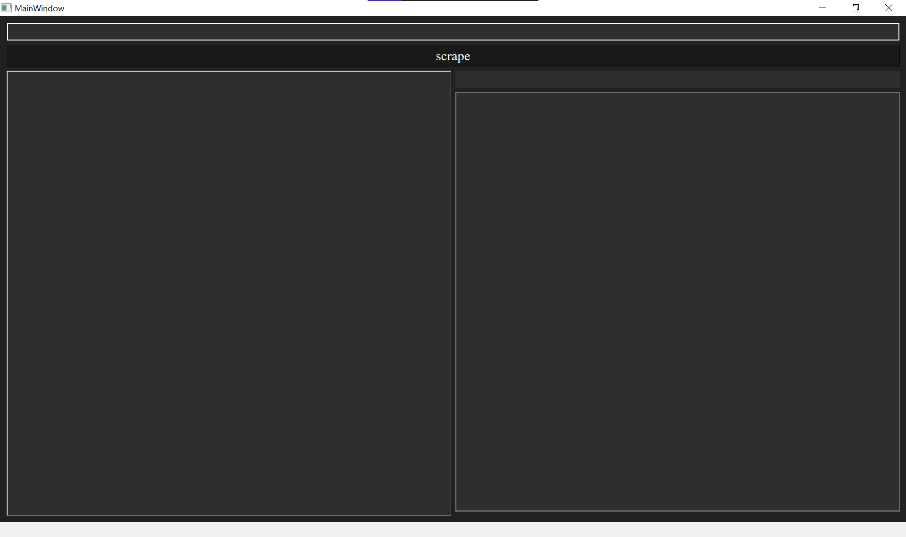
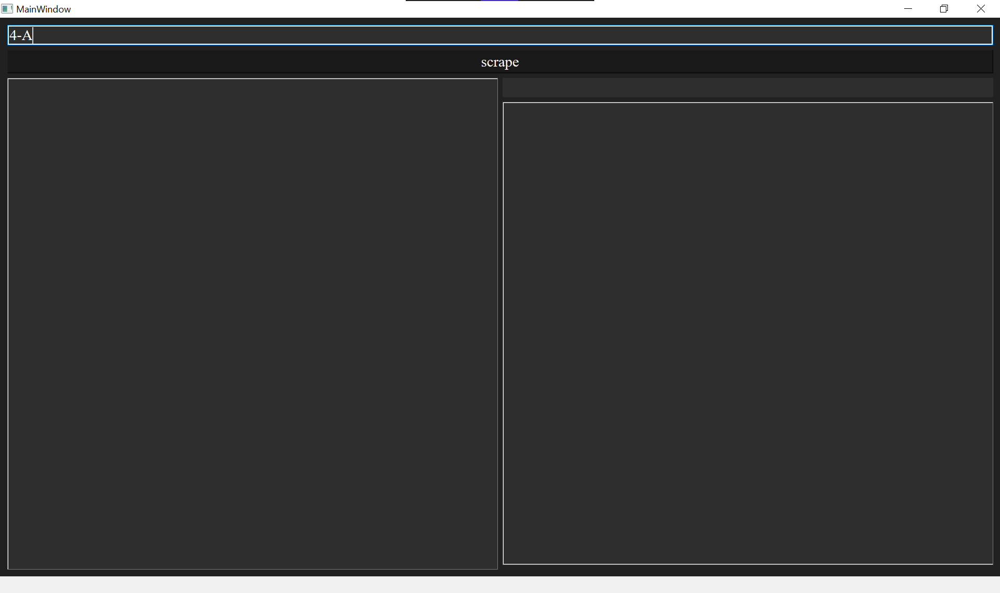
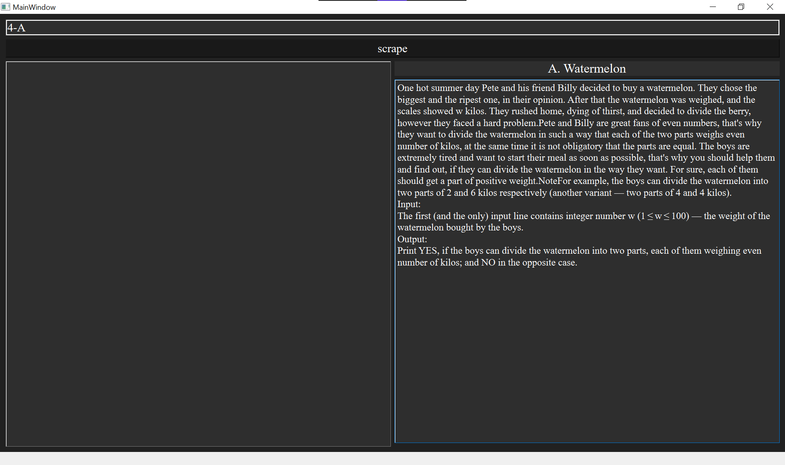
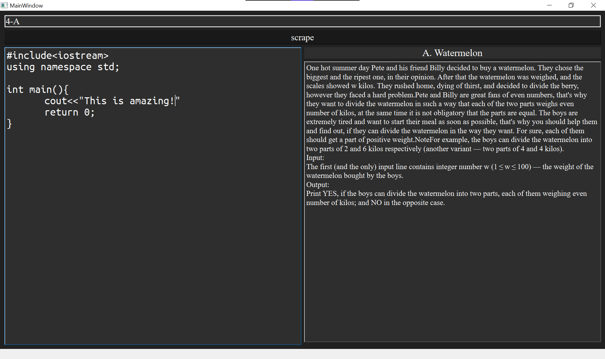

# CP Editor

This is my attempt at building a CP specific code editor. 

### Setup
- If not done already, setup this project using [this](https://github.com/Abhijna-Raghavendra/CodeforcesAPI/blob/master/README.md).
- Checkout to the ```orange/editor``` branch using:
 ```sh 
  git checkout orange/editor
 ```
- Run the desktop app using 
```py
python app.py
```

### Usage
- Upon running the app, if all went well you should see a screen like this   

  
- Enter the Codeforces problem number in the text box (refer example img for format)   
  
  
- Press the scrape button and you should get your problem   
  
  
- Start coding in the left tab   
  
  

And...you're good to go!! Enjoy!! :heart: